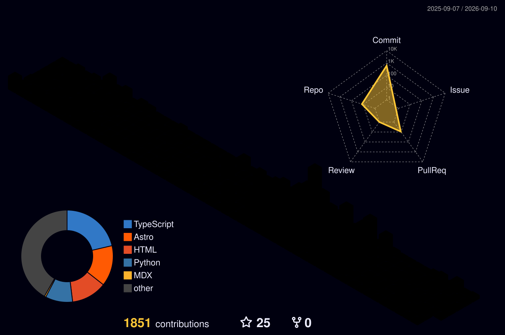

<h1 align="center">Hello there! My name is Fabrizio Terzi. 🤓</h2>

E-Learning Specialist, @BergamoHub: Workscape e-Learning Designer and - IT consultant - Technical Support & Training. Very interested in Digital Education Solutions and Innovation. 

  
  
  
  
  
  

<i>"A dream you dream alone is only a dream. A dream you dream together is reality".

</a>
  

 https://fabrizio.pyragogy.org

---

## Educational Background
* Educational Research
* e-Learning
* Music Theory and Composition
* Data Science
* Peeragogy

## Certifications:
* [Teaching for Educators: Development and Delivery Professional Certificate | @UBC](https://credentials.edx.org/credentials/4f1582fd38b04602878732da7a48bb93/)
* [Design and Development of Educational Technology | @MITx](https://courses.edx.org/certificates/7e61aad7c34c4ace834e8d8fec150fd3)
* [Change the global course of Learning | @Stanford Edx ](https://verify.class.stanford.edu/SOA/6933f9f6f1ce42b18cfc6408ab832c38) 
* [Social Learning for Social Impact | @McGill University School](https://courses.edx.org/certificates/5f4b2ed6693943369fdbffc1f76f6073) 
* [Problem-Based Learning: Principles and Design | @Maastricht University](https://novoed.com/problem-based-learning/statement_template?user_id=730267)

  ---

  

  

## 📚 Publications - Fabrizio Terzi ([ORCID: 0009-0004-7191-0455](https://orcid.org/0009-0004-7191-0455))  

### [Cognitive Rhythm Theory: AI–Human Co-Creation Education and Beyond](https://zenodo.org/records/15480363) 
 
*A formal theory of cognitive synchronization, resonance, and phase shifts in human–AI interaction.*  

- Introduces the **Cognitive Rhythm Theory** as a framework for human–AI co-creation.  
- Proposes a **mathematical model of cognitive rhythm**:  
  `RC(H,A,t) = f(∆ΦH, ∆ΦA, S(t), R(t))`  
- Explores synchronization, resonance, and phase shifts in shared cognitive processes.  

---

### [Cognitive Intraspecific Selection in Education: From Individualism to Collective Strength](https://zenodo.org/records/16962409)  
 
*Transposes the biological concept of intraspecific selection into the field of education.*  

- Shifts the **unit of selection** from individuals to ideas (cognitive constructs).  
- Structured around four isomorphisms:  
  - Variation – epistemic diversity  
  - Selection – critical comparison of ideas  
  - Heritability – cultural transmission  
  - Adaptation – conceptual evolution  
- Operationalized through **Pyragogy**, an evolutionary peer-to-peer pedagogy:  
  - Cognitive Reciprocation  
  - Ritualization of Conflict  
  - Facilitation through Artificial Intelligence  
- Supported by metrics such as the **Epistemic Quality Index (EQI)** and the **IdeoEvo** experimental design.  

**Keywords**: cognitive rhythm, intraspecific selection, evolutionary education, AI–human co-creation, pyragogy  

---

### [Eco-System: Fonetica Italiana Mnemonica](https://doi.org/10.5281/zenodo.17436054)
*Phonetic Conversion Framework for the Italian Language — Published on Zenodo (2025)*
Eco-System reinterprets the connection between numbers and sounds according to Italian phonology, offering an original cultural and cognitive mnemonic model.
**DOI:** [10.5281/zenodo.17436054](https://doi.org/10.5281/zenodo.17436054)

<!--
**FTG-003/FTG-003** is a ✨ _special_ ✨ repository because its `README.md` (this file) appears on your GitHub profile.
-->

